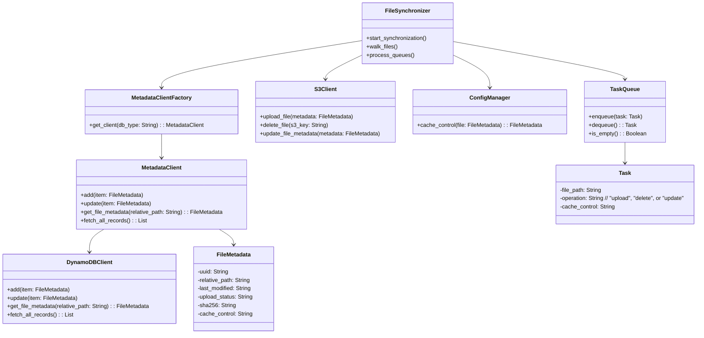

# Requirements and Design Document

## Purpose

The objective is to develop a Python-based program capable of achieving comprehensive synchronization between files in a specified local directory (including its subdirectories) and an AWS S3 bucket. Simultaneously, the system will persist relevant metadata in an AWS DynamoDB table to ensure efficient tracking and auditing of synchronization operations.

### Requirements

1. **File Synchronization:**

   - Ensure all files in the target directory and its subdirectories are mirrored in the specified AWS S3 bucket.
   - Support bi-directional synchronization with conflict resolution strategies.
   - Detect and propagate changes such as additions, deletions, and updates.

2. **Metadata Persistence:**

   - Store detailed metadata for each file, including but not limited to file name, size, last modified timestamp, and synchronization status.
   - Leverage AWS DynamoDB or Elasticsearch or AWS SimpleDB for metadata storage to enable scalability and low-latency access. Elasticsearch and AWS SimpleDB will come later, but the design should consider to support them with mini change.

3. **Performance:**

   - Optimize for high throughput and low latency.
   - Ensure efficient handling of large datasets and deeply nested directories.

4. **Error Handling and Logging:**

   - Implement robust error handling to manage transient AWS service failures.
   - Log synchronization activities comprehensively for audit and debugging purposes.

5. **Security:**

   - Utilize AWS Identity and Access Management (IAM) roles and policies to secure S3 and DynamoDB access.
   - Encrypt data in transit and at rest.

6. **CI/CD and Containerization:**

   - Provide a Dockerfile and Dev Container configuration for streamlined development and deployment.
   - Dev Container will use same Dockerfile as project
   - Ensure compatibility with CI/CD pipelines.

## Database Design

### Metadata DB Table Schema

| Attribute       | Type   | Description                                                         |
| --------------- | ------ | ------------------------------------------------------------------- |
| `uuid`          | String | Primary Key: Universally Unique Identifier                          |
| `relative_path` | String | Path relative to the synchronization root                           |
| `last_modified` | String | Timestamp denoting the last local modification                      |
| `upload_status` | String | Status: upload_pending, delete_pending, update_pending or uploaded  |
| `sha256`        | String | SHA-256 hash for content verification                               |
| `cache_control` | String | Cache-Control settings applied to the file                          |
|                 |        |                                                                     |

### DynamoDB

#### AWS CLI Command to Create DynamoDB Table

To create this table in a cost-effective manner, ensuring flexibility while adhering to AWS free-tier limits, use the following AWS CLI command:

```bash
aws dynamodb create-table \
    --table-name FileSyncMetadata \
    --attribute-definitions \
        AttributeName=uuid,AttributeType=S \
        AttributeName=relative_path,AttributeType=S \
    --key-schema \
        AttributeName=uuid,KeyType=HASH \
    --global-secondary-indexes '[
        {
            "IndexName": "RelativePathIndex",
            "KeySchema": [
                {
                    "AttributeName": "relative_path",
                    "KeyType": "HASH"
                }
            ],
            "Projection": {
                "ProjectionType": "ALL"
            }
        }
    ]' \
     --billing-mode PAY_PER_REQUEST \
     --on-demand-throughput MaxReadRequestUnits=25,MaxWriteRequestUnits=25 \
     --tags Key=Environment,Value=Development
```

#### UML for DynamoDB Table


#### Query Example

To retrieve metadata for a specific file based on its relative path, you can use the following AWS CLI command, assuming the global secondary index `RelativePathIndex` has been set up:

```bash
aws dynamodb query \
    --table-name FileSyncMetadata \
    --index-name RelativePathIndex \
    --key-condition-expression "relative_path = :path" \
    --expression-attribute-values '{":path": {"S": "example/path/to/file.txt"}}'
```

This command fetches the metadata for the file located at `example/path/to/file.txt` in the synchronization root.

### Elasticsearch

[TBD]

### AWS SimpleDB

[TBD]

## Code design

#### Workflow

metadata db currently will use DyanmoDB, will support Elasticsearch and AWS SimpleDB later.


#### Configruation yaml file

An example of `config.yaml`

```yaml
deployment:
  - storage:
      type: "s3"
      name: "my-sync-bucket"
    metadb:
      type: "dyanmodb"
      dbname: "dyanmodb"
      name: "my-sync-table"
# Logging and Monitoring Configuration
logging:
  level: "INFO"               # Supported values: DEBUG, INFO, WARNING, ERROR, CRITICAL
  format: "json"              # e.g., "json", "text"
  output: "stdout"            # e.g., "stdout", "file", "syslog"
  # Additional logging parameters (if needed)
  # file_path: "/var/log/myapp.log"
  # If integrating with CloudWatch or another monitoring tool

# Description: This file contains the configuration for the cache control module.
# The default settings are applied to all the files, and the rules are applied to the files that match the mimetype.
# The age is calculated based on the item and max values. 
# The item value time since last modified date, and the max value is the maximum time that the file is cached.
# d = day, w = week, m = month, y = year
# The cache control will be set based on the settings value. if the item older then item then max-age will be set to max value.
cache_control:
  default:
    max-age: 3600
    settings: "public,must-revalidate"
  rules:
    - mimetype: ["text/html", "text/css", "application/javascript"]
      settings: "public,must-revalidate"
      age:
        - item: 1w
          max: 1d
        - item: 1m
          max: 1w
        - item: 1y
          max: 1m
    - mimetype: ["image/*", "video/*", "audio/*"]
      settings: "public,must-revalidate"
      age:
        - item: 1w
          max: 1d
        - item: 1m
          max: 1w
        - item: 1y
          max: 1m

# Synchronization Settings
sync:
  root_path: "/path/to/local/directory"
  exclude_patterns:
    - "*.tmp"

workers: 5
```

when processing tasks in upload queue, will also set blob file's cache control base on the cache control rule in config file

#### Python API design

##### Class and Interface Design



